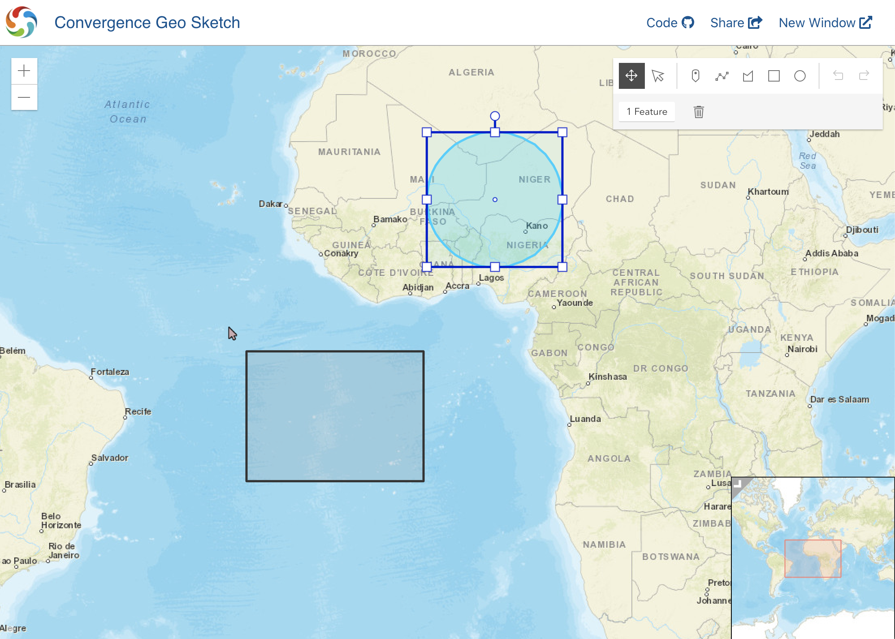

<div align="center">
  
</div>

# Convergence GeoSketch Demo
[](https://travis-ci.org/convergencelabs/geo-sketch-demo)

This demo application show how Convergence can be used to collaborate a GoeSpatial / geometric data. Major features include:

  * Collaborative drawing
  * Remote pointer cues
  * Remote viewport awareness

<div align="center">
  
</div>

The major components used building this app are as follows:
  * [Convergence](https://convergence.io)
  * [ArcGIS JavaScript API](https://developers.arcgis.com/javascript/)
  * [React](https://reactjs.org/)
  * [MobX](https://mobx.js.org/)
  * [MobX React](https://mobx.js.org/)
  
Many thanks to the authors of these projects!

## Running
To run this app you will need a running instance of the Convergence Server. The simplest way to achieve this is to use the [Convergence Omnibus Docker container](https://hub.docker.com/r/convergencelabs/convergence-omnibus). You may need to [install Docker](https://docs.docker.com/get-docker/) for your platform if you don't have it.See the documentation for the container, but the below should get you going:  

```shell script
docker run -p "8000:80" --name convergence convergencelabs/convergence-omnibus
```

In the public directory you will need to change the `domainUrl` setting to point to your domain connection url.  If you used the command above it should be set to:

`ws://localhost:8000/convergence/default`

Then simply the following command to start the react app: 

```shell script
npm start
```


## Available Scripts
This project was bootstrapped with [Create React App](https://github.com/facebook/create-react-app).

In the project directory, you can run:

### `npm start`

Runs the app in the development mode.<br />
Open [http://localhost:3000](http://localhost:3000) to view it in the browser.

The page will reload if you make edits.<br />
You will also see any lint errors in the console.

### `npm run build`

Builds the app for production to the `build` folder.<br />
It correctly bundles React in production mode and optimizes the build for the best performance.

The build is minified and the filenames include the hashes.<br />
Your app is ready to be deployed!

See the section about [deployment](https://facebook.github.io/create-react-app/docs/deployment) for more information.


## Support
[Convergence Labs](https://convergencelabs.com) provides several different channels for support:

- Please use the [Discourse Forum](https://forum.convergence.io) for general and technical questions, so the whole community can benefit.
- For paid dedicated support or custom development services, [contact us](https://convergence.io/contact-sales/) directly.
- Chat with us on the [Convergence Public Slack](https://slack.convergence.io).
- Email <support@convergencelabs.com> for all other inquiries.

## License
The Convergence GeoSketch Demo is licensed under the [MIT](LICENSE) license. Refer to the [LICENSE](LICENSE) for the specific terms and conditions of the license.
